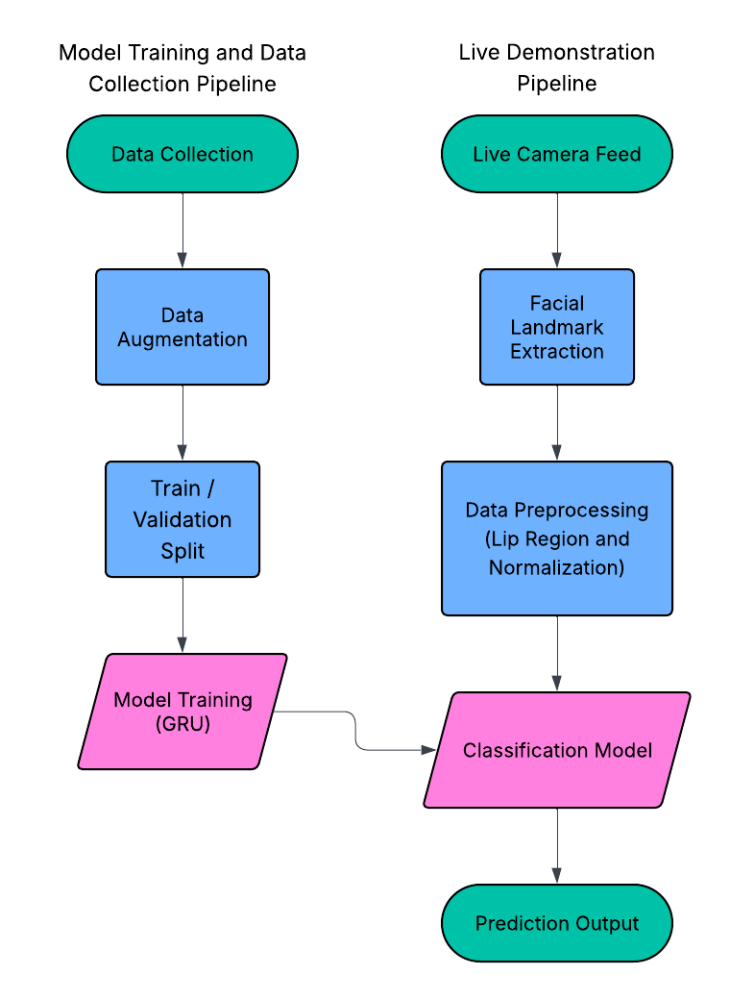

  
   
  <i>“A real-time lip-reading demo that detects spoken words from video alone using MediaPipe facial landmarks, a simple CNN, and a GRU Recurrent Neural Network.”</i>
   
   
  SanD Hacks 2026 Best Overall Hack
   
  Michelle Dong, Caden Cheng, Julia Jin, David Wan

---

## Our Project

### Our Inspiration

We intend for Silent Speech to be a lip-reading AI system that transcribes what someone is saying based on the movement of their face. Our project proves useful because audio transcription alone is unreliable; recorded audio can be muffled or intelligible, and in real-time, some people murmur or slur their words. These problems have already shown prevalence in YouTube auto-captions or Zoom live meeting captions, where transcription based on audio alone often misinterprets or fails to catch some words that are spoken. Pairing the existing audio based transcription with a new technology—computer vision based lip reading—would provide a more reliable transcription. In the future, we can see our technology’s implementation being expanded on through extended reality. Namely, augmented reality glasses such as the Meta AI Ray-Bans could display real-time transcription when others are talking, which would be a less expensive alternative for those who are hard of hearing than hearing aids or auditory surgery for extreme cases. The same technology could also help facilitate communication between people who speak different languages by incorporating lip-reading detection into translation technology, which would make auditory-assitive devices more accessible to the general population.

### Challenges

The largest challenge we encountered during this hackathon was the process of collecting data. Initially, we wanted to collect lip detection data from a variety of people to have a diverse dataset, but then we realized that a lot of people didn’t really understand how the data collection process worked which gave us a lot of faulty and inconsistent data; we ended up having to record much of the data on our own, which was mentally and physically and time-wise taxing. We settled on a data collection pipeline that collects important facial landmarks such as keypoints on the lips and jaws that move around when we speak. Using a webcam utilizing OpenCV2, each frame is processed using MediaPipe to detect landmarks on a person’s face. While recording, a green frame is displayed on the user’s facial landmarks to show what is being recorded. From these landmarks, features such as mouth width, landmark positions, and movement velocities are extracted and saved as a .npz file into a separate folder.

Another huge problem we faced was our lack of proper hardware: because we only had laptop CPUs and no Nvidia GPUs, we knew that we had to keep our ai model lightweight. That resulted in a lot of complications in our project as we were unable to go with our initial idea of simply using image detection to implement our lip-reading system, and instead had to find an alternative method around it. We looking into keypoint detection and facial landmark recognition, which allowed us to condense the normally large dataset of images into a smaller numerical dataset in the form of a NumPy array and in turn, to make a lightweight ai model that we could train on our Apple (Mac) CPUs.

### Version 1 Demo

Our live demonstration pipeline takes in a live camera input and parses each frame with OpenCV2. It then runs the MediaPipe facial keypoint detector, which produces a NumPy array of all the important keypoints. It also crops and preprocesses a region of interest (ROI) around the mouth and passes it into a lightweight CNN, producing another NumPy array. Finally, it passes both the landmark and the ROI NumPy array into our pretrained model, allowing us to run demonstration predictions on a live video feed.

---

## Our Technical Architecture

  

## What Makes Us Unique

Silent Speech is particularly unique from other lip readers because of how cost efficient its architecture is. Our model only utilizes the most important facial landmarks in the form of a vector as well as a grayscale image of the mouth region in order to run predictions. In the future, we envision that Silent Speech can be implemented in replacement of current transcription systems at a much cheaper cost.

### Links

<a href="https://devpost.com/software/silent-speech-lip-reading?_gl=1*1q5q98s*_gcl_au*MzAwMzAzMjg1LjE3NjUzMTgxNTQ.*_ga*NzI0NTE0Nzc4LjE3NjUzMTgxNTQ.*_ga_0YHJK3Y10M*czE3NzAwNzI5NjgkbzExJGcxJHQxNzcwMDczOTgxJGoyNiRsMCRoMA..">Devpost</a>
 
<a href="https://www.youtube.com/watch?v=qmZ1zTPY3Lc">YouTube Demo</a>

### Contact Us

If you're interested in the ongoing development of Silent Speech, contact us!

Michelle Dong: mydong@ucsd.edu
David Wan: dpwan@ucsd.edu
Caden Cheng: cfc005@ucsd.edu
Julia Jin: juj021@ucsd.edu

---

Thanks for checking out Silent Speech! We're likely going to continue working on Silent Speech as a personal project in the future, so stay tuned for updates :)

Last Updated: February 2nd, 2026
